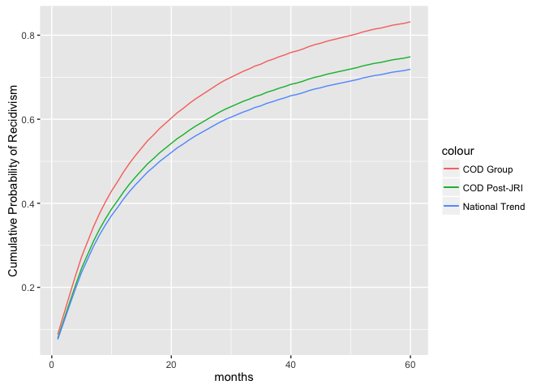

Utah Recidivism Model
================

About This Model
----------------

The following code is to analyze data and make ballpark predictions about how much a reduction in recidivism could potentially save the State of Utah. We are specifically interested in parolees with co-occuring disorders (COD).

### Assumptions

The greatest challenge in making predictions about the costs and benefits of the COD population is that the Justice Reinvestment Initiative (JRI) is old enough to affect outcomes in areas like recidivism, prison terms, crime frequencies, and parole sentences, but not old enough to collect reliable data on those effects. Therefore, I am forced to make several assumptions about the likely effects of the JRI on these outcomes. I will try to list some of the important ones below, but there are other assumptions throughout this notebook.

``` r
# A 10% reduction in recidivism 
recid_reduction_JRI <- .10

# One big change is that offenders can get what's called earned time credits while incarcerated, 
# which can also impact their length of stay (reduce it).
# A 20% reduction in mean time served seems reasonable
time_served_scale_JRI <- .8
```

About the data
--------------

The two main datasets that inform this model are,

-   Prison Terms, which contain crime frequencies, their estimated average prison sentence, and an estimate of the direct taxpayer costs associated with that crime

-   Survival Rates, which are the kaplan-meier curves from national data, extrapolated to fit Utah's trends

### Prison Terms

I pieced this data together using a an email from Julie Christensen, which contained the offense frequencies for our COD demographic, and various reports from the CCJJ. For the "frequency" column, I took the "frequency\_of\_crime" and added parole violations, which used to account for 70% of returns. In the model, "frequency" is used when the person is on parole, and "frequency\_of\_crime" is used when they are not. The [Justice Reinvestment Report](http://justice.utah.gov/Documents/CCJJ/Reports/Justice_Reinvestment_Report_2014.pdf) and [ACLU Report](http://www.acluutah.org/criminal-justice/item/download/15_0cfccf37c91e9fb16be4ac2e89ca12f2) contain the mean time served for various offenses, which I scale down 20% (as described above). Finally, the [Cost of Crime Report](http://www.justice.utah.gov/Documents/CCJJ/Cost%20of%20Crime/Utah%20Cost%20of%20Crime%202012%20-%20Methods%20Review%20Cost.pdf) contains estimates of the taxpayer costs for most categories (extrapolated for parole violations).

``` r
prison_terms <- read.csv("./clean_data/prison_terms.csv", stringsAsFactors = FALSE) %>% 
  mutate(mean_time_served = round(mean_time_served)) %>% 
  select(-assumptions)

# I do these so that I can add a blank in the function below
prison_terms[8,1] <- ""

# replcace NAs with 0
prison_terms$frequency[is.na(prison_terms$frequency)] <- 0
prison_terms$frequency_of_crime[is.na(prison_terms$frequency_of_crime)] <- 0

# Scale down time served to reflect (guess)timated effects of the JRI
prison_terms$mean_time_served <- prison_terms$mean_time_served * time_served_scale_JRI

# Another big change from the JRI is that prison sentences for technical violations are capped
# So we change the 15-month mean to a 2-month one
# page 39: http://www.utah.gov/pmn/files/172049.pdf
prison_terms$mean_time_served[prison_terms$offense_type == "Parole_Violation"] <- 2

# Pretty printing
kable(head(prison_terms, 10), digits = 3)
```

| offense\_type     |  mean\_time\_served|  frequency\_of\_crime|  frequency|  court\_cost|  police\_cost|
|:------------------|-------------------:|---------------------:|----------:|------------:|-------------:|
| Murder            |               167.2|                 0.017|      0.005|        62037|          4509|
| Person            |                49.6|                 0.238|      0.070|         5443|          4509|
| Sex               |                58.4|                 0.067|      0.020|         5443|          4509|
| Property          |                18.4|                 0.314|      0.093|         2284|           880|
| Drug              |                14.4|                 0.221|      0.065|         2284|           880|
| Other             |                13.6|                 0.143|      0.042|         2284|           880|
| Parole\_Violation |                 2.0|                 0.000|      0.705|         2284|           880|
|                   |                  NA|                 0.000|      0.000|           NA|            NA|

### Survival Rates

The kaplan-meier curves come from this [BJS Report](http://www.bjs.gov/index.cfm?ty=pbdetail&iid=4986) of national trends. I do not have clean data showing the exact Utah curves (nor does such data exist for the post-JRI era), but I was encouraged to learn that the 3-year outcomes for Utah pre-JRI were very similar to national trends. Threfore, I assume similar curves, and simply increase the recidivism rates to better reflect our COD demographic, and then decrease them in an attempt to reflect the COD demographic post JRI. In all likliehood the actual curves for the post-JRI period will be different; but these provide decent estimates.



A Stochastic Agent-based Model
------------------------------

Although this does not have all of the features commonly associated with an agent-based model (ABM), I use this term to describe the two-pronged process followed below:

1.  Simulating a single agent for five years from the time he or she leaves prison. Each agent may return to prison immediately, or stay out of prison for the entire 60 months. The odds of these events are based on real data, but are stochastic in the sense that they are not predetermined.
2.  Repeating this simulation thousands of times to see how the results vary.

### Using Real Data to Simulate Recidivism

The first step in this process is to turn data from the survival curves into an estimate of a parolee's odds of recidivating in a given month, e.g., `P(relapse|months free)`. To do that, I wrote a function that first defines the correct survival curve, and then transforms the data from the cumulative probabilty of being arrested *by* time period (t), to the individual probabilty of being arrested *in* period (t).

``` r
# Load survival data: the single argument is for reducing recidivism to model some intervention
load_survival_data <- function(recid_reduction_ovr_cntrl){
  
  # This is the increased rate of recidivism of our COD group, relative to national
  COD_group_increase = 0.157
  
  survival_rates <- read.csv("./clean_data/mschpprts05f02.csv", 
                             stringsAsFactors = F) %>% 
    filter(X != "",
           X != "National") %>% 
    mutate(In.state = as.numeric(X.1),
           
           # Increase from COD group
           In.state = In.state + (In.state * COD_group_increase),
           
           # Minus the JRI reduction
           # This is defined in the assumptions section above
           In.state = In.state - (In.state * recid_reduction_JRI),
           
           # If we expect further reductions from targeted intervention
           In.state = In.state - (In.state * recid_reduction_ovr_cntrl)) %>% 
    
    # Now turn the data into P(relapse | t)
    mutate(cumulative_percent = In.state / 100,
           cumulative_prob_did_not = 1 - cumulative_percent,
           prob_recidivate = 1 - cumulative_prob_did_not / lag(cumulative_prob_did_not),
           prob_did_not_recidivate = 1 - prob_recidivate) %>% 
    filter(In.state != 0) %>% 
    select(prob_recidivate, prob_did_not_recidivate)
}
```

When loaded with no treatment assumed, the first five rows of data look like this:

|  prob\_recidivate|  prob\_did\_not\_recidivate|
|-----------------:|---------------------------:|
|             0.079|                       0.921|
|             0.046|                       0.954|
|             0.049|                       0.951|
|             0.050|                       0.950|
|             0.050|                       0.950|

These estimates show that in the first month, someone from the COD group has about a 8% chance of recidivating. But if he can make it 4 months, that drops to only 5% in month 5. Using these data, we are now ready to populate our model.

### Functions for the Model
