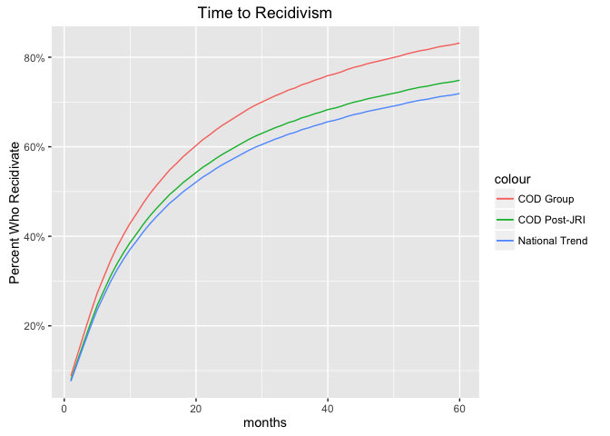
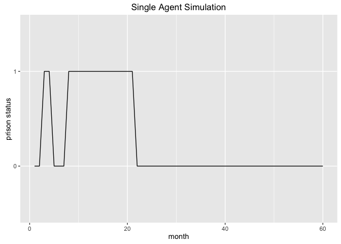
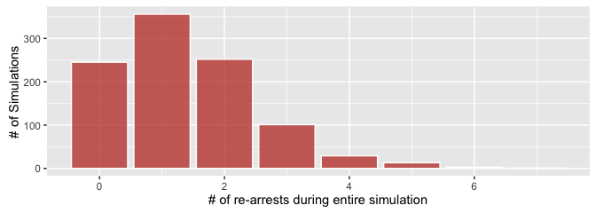
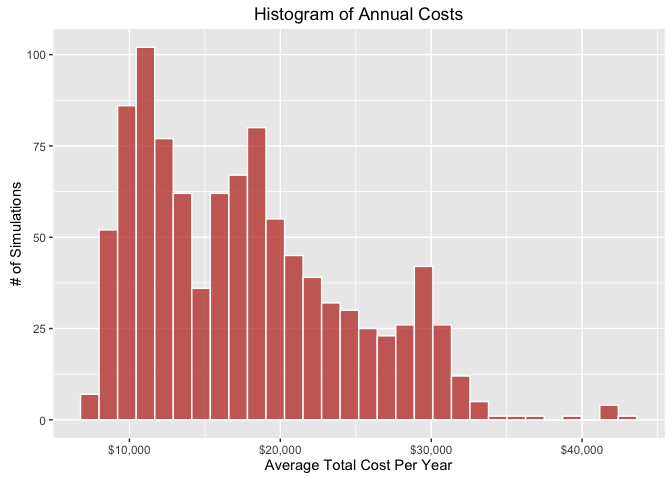
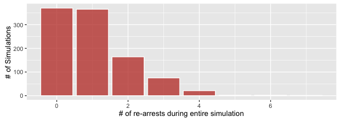

The Costs and Benefits of Reducing Recidivsm in Utah
================

This report describes work done by staff at the [Sorenson Impact Center](http://eccles.utah.edu/sorenson-impact-center/) of the University of Utah to quantify the costs and benefits of a program to reduce recidivism among parolees with a dual diagnosis. The state of Utah has taken several principled actions to reduce recidivism and better address the needs of former prisoners, most notably the Justice Reinvestment Initiative (JRI). The program under consideration continues in that tradition by proposing to offer intensive case work services to parolees with co-occurring disorders (COD). The expectation is that these efforts will reduce recidivism, as they have in previous experiments.

The potential benefits of reducing jail time for the COD population are numerous. In this report, we focus mainly on the economic benefits that accrue to the state of Utah, paying particular attention to prison costs. Data from the Utah Department of Corrections demonstrate that the average prisoner costs the State $81.34 per day, or approximately $30,000 per year.

The challenge is determining how much time the average person from the COD demographic is expected to spend in prison, once released, and what reducing that is likely to save the State. This is a difficult prediction problem, given all of the factors; but we have created a model that does a reasonable job of simulating a person's chances of returning to prison. With that information, we can scale up - that is, simulate a thousand people and collect statistics on the outcome. The assumptions, challenges, and conclusions of this approach are described in the following pages.

As the statistician George Box [famously observed](https://en.wikipedia.org/wiki/All_models_are_wrong), "all models are wrong but some are useful." We hope this one is useful.

Recidivism Rates
================

Description:
------------

This is the estimated percent of parolees who will return to prison within a given time after release.

Sources:
--------

The kaplan-meier curves come from this [BJS Report](http://www.bjs.gov/index.cfm?ty=pbdetail&iid=4986) of national trends. The Utah Department of Corrections also provided recidivism rates for the 2012 release cohort, which allowed for tracking of the COD population over three years. I do not have data showing the exact Utah curves (nor does such data exist for the post-JRI era), but I was encouraged to learn that the 3-year outcomes for Utah pre-JRI were very similar to national trends.

Assumptions:
------------

-   The survival curves for the COD population will bend in similar ways to national trends
-   The JRI will reduce recidivism among the COD population by 10%.

Statistics
----------

-   Pre-JRI, approximately 47% of the COD population re-offended within one year.
-   Approximately 74% re-offended within three years.
-   If, as this model assumes, the JRI reduces recidivism by 10%, there will still be 66% of the COD population who recidivate within three years.

The following chart shows estimated survival curves from national averages, the COD population pre-JRI, and post-JRI with a 10% reduction in recidivism. The X-axis is time in months over a period of five years. The Y-axis is the cumulative percent who recidivate at least once. The chart shows that recidivism is more likely in the first year, and then tapers off over time. This suggests that if a program is effective at helping people early on, it will be more effective than if it aims to help people several months removed from their release.

Crime Types
===========

Description:
------------

These data show the frequency of certain crime types among parolees. They differ from the survival curves in that they show not the time it takes to reoffend, but what type of crime is most likely to be involved in the event of a reoffense.

Sources:
--------

I pieced this data together using a an email from Julie Christensen, which contained the offense frequencies for our COD demographic, and various reports from the CCJJ. For the "frequency" column, I took the `frequency_of_crime` and added parole violations, which used to account for 70% of returns. In the model, `frequency` is used when the person is on parole, and `frequency_of_crime` is used when they are not. Finally, the [Cost of Crime Report](http://www.justice.utah.gov/Documents/CCJJ/Cost%20of%20Crime/Utah%20Cost%20of%20Crime%202012%20-%20Methods%20Review%20Cost.pdf) contains estimates of the taxpayer costs of these crimes, from which I take the policing and court costs.

Assumptions:
------------

-   The crime type frequencies for a reoffense will be similar to those from the original offense with one major difference: the reoffense frequencies will include parole violations, which are very common.
-   Parole costs are similar to those of a property crime.

Statistics
----------

-   Property crimes are the most likely type of crime, at 31% of all crimes committed while off parole. It is also the least expensive at $3,164 (court and policing costs).
-   Murder is the least likely, at 2%, but the most expensive by far at $66,546
-   When on parole, the most likely reason to be sent back is for a technical violation. These account for about 70% of recidivism occurrences.

The following table shows these frequencies and costs (for court and policing).

| offense\_type     | frequency\_of\_crime | frequency | cost    |
|:------------------|:---------------------|:----------|:--------|
| Murder            | 1.7%                 | 0.5%      | $66,546 |
| Person            | 23.8%                | 7.0%      | $9,952  |
| Sex               | 6.7%                 | 2.0%      | $9,952  |
| Property          | 31.4%                | 9.3%      | $3,164  |
| Drug              | 22.1%                | 6.5%      | $3,164  |
| Other             | 14.3%                | 4.2%      | $3,164  |
| Parole\_Violation | 0.0%                 | 70.5%     | $3,164  |

Prison Time Served
==================

Description:
------------

If convicted, these data show the length of time a parolee can expect to spend in prison, on average, for the various crime types.

Sources:
--------

The [Justice Reinvestment Report](http://justice.utah.gov/Documents/CCJJ/Reports/Justice_Reinvestment_Report_2014.pdf) and [ACLU Report](http://www.acluutah.org/criminal-justice/item/download/15_0cfccf37c91e9fb16be4ac2e89ca12f2) contain the mean time served for various offenses, which I scale down to reflect changes from the JRI (as described below).

Assumptions:
------------

-   The JRI will reduce the mean prison time served by about 20% for all crime types. This is just a guess as there are not enough empirical data points to confirm what the JRI will do to time served, but it is almost certain that sentences will be reduced.
-   The average prison sentence for technical violations will go from 15 months to approximately 2. This is also a guess based on the new [sentencing guidelines](http://www.utah.gov/pmn/files/172049.pdf).
-   The average parole sentence will go from three years to 18 months for those who exhibit good behavior, as per [this](http://law.justia.com/codes/utah/2006/title76/76_03009.html) document.

Statistics
----------

-   Prior to the JRI, murder resulted in the longest average prison sentence at 209 months.
-   The second longest was for sex crimes: 73 months.

Here is a table of the actual values and the estimated values for the post-JRI period.

| offense\_type     |  mean\_time\_served|  mean\_time\_served\_post\_JRI|
|:------------------|-------------------:|------------------------------:|
| Murder            |                 209|                            167|
| Person            |                  62|                             50|
| Sex               |                  73|                             58|
| Property          |                  23|                             18|
| Drug              |                  18|                             14|
| Other             |                  17|                             14|
| Parole\_Violation |                  16|                              2|

Costs
=====

Description:
------------

These are assumptions, estimates, and past data about the direct taxpayer costs of caring for a parolee both in and out of prison.

Sources:
--------

As described above, the [Cost of Crime Report](http://www.justice.utah.gov/Documents/CCJJ/Cost%20of%20Crime/Utah%20Cost%20of%20Crime%202012%20-%20Methods%20Review%20Cost.pdf) contains estimates of the taxpayer costs of these crimes, from which I take the policing and court costs. The costs of prison, parole, and shelters come from two PDF reports given to the Center by the Department of Corrections: one that details the cost per day for prisons, and one for parole services, including costs for Community Correctional Centers (CCC). Aggregated DWS and DHS cost data were given to the Center by the respective agencies.

Assumptions:
------------

-   Once released, a parolee will spend about 10% of his or her time, on average, in a shelter. This is based on data from the state of California, where "10% of the state’s parolees are homeless," according to [this report](http://www.endhomelessness.org/page/-/files/1101_file_Cho_Presentation.pdf).
-   Parolees will use DWS services at rates similar to the average childless male who utilizes these services.
-   Apart from recidivism, most probabilities are not conditional in this model. This simplifies the analysis, and helps to find averages, instead of extreme outliers.
-   To be conservative, this model estimates that the total DHS spending is $3,000 per parolee per year. (DHS spends about $3,000 annually per client on substance use treatment, and $3,000 per client on mental health services. Even though some of the COD population could be utilizing both types of service, there may also be some who utilize neither).
-   I assume that DWS, DHS, shelter, parole, and other similar costs are only borne by the state when the parolee is out of prison.
-   DHS costs include some inpatient and outpatient care (e.g., methadone). I also assume that the average parolee will visit the ER two times per year, while free, at an average cost of $2,400 per trip.

Statistics
----------

-   The average annual cost to house a prisoner is approximately $30,000. This is the largest cost associated with the average parolee.

About the model
===============

Description:
------------

\[Note: this section is more technical. For the results, skip forward a couple pages\].

Although this does not have all of the features commonly associated with an [agent-based model](https://en.wikipedia.org/wiki/Agent-based_model), I use this term to describe the two-pronged process followed here:

1.  Simulate a single agent for five years from the time he or she leaves prison. Each agent may return to prison immediately, or stay out of prison for the entire 60 months. The odds of these events are based on real data and are stochastic in the sense that they are not predetermined.
2.  Repeat this simulation thousands of times to see how the results vary.

Sources:
--------

I had the idea to use an agent-based model when it occurred to me how difficult it would be to calculate costs for parolees given that they are likely to move in and out of the prison system multiple times. I loosely based my model on the principles from [this article](http://www.babelgraph.org/wp/?p=237)

The first step in this process is to turn data from the survival curves into an estimate of a parolee's odds of recidivating in a given month. The conditional probability of continued freedom is given by:

\[P_i = \frac{f_i - r_i}{f_i}\]

where *f* is the number of people free but at risk of recidivating in the *i*th interval, and *r* is the number who recidivated in the same period.

When loaded with no treatment assumed, the first five rows of data look like this:

|  month| prob\_recidivate | prob\_did\_not\_recidivate |
|------:|:-----------------|:---------------------------|
|      1| 7.91%            | 92.09%                     |
|      2| 4.64%            | 95.36%                     |
|      3| 4.86%            | 95.14%                     |
|      4| 4.99%            | 95.01%                     |
|      5| 4.98%            | 95.02%                     |

These estimates show that in the first month, someone from the COD group has about an 8% chance of recidivating. But if he can make it 4 months, that drops to only 5% in month 5. Using these data, we are now ready to populate our model.

Assumptions:
------------

-   It is advisable to look at average costs over the course of 5 years with a sample of at least 1000 simulated agents. Shorter time frames with fewer simulations may lead to anomalous results.

### Single Agent

When run for a single person, the resulting data contain 5 rows, each representing a month in the life of the simulated parolee. The columns track outcomes of the simulation and their associated costs: month, year, months\_free, rearrested\_or\_not, prison\_sentence, crime\_type, is\_in\_prison, is\_on\_parole, parole\_sentence, marginal\_prison\_costs, total\_prison\_costs, total\_court\_costs, total\_policing\_costs, is\_in\_shelter, total\_shelter\_costs, total\_parole\_costs, total\_DWS\_DHS\_costs, total\_ER\_costs.

The main driver of costs and savings is prison time, which is represented by a binary \[0,1\] variable, where 1 means "in prison." For a single agent, that could be represented in the following chart, where the X-axis is time in months, and the Y-axis is prison status:

Multiple Agent Simulation
-------------------------

The power of this model comes from tracking the outcomes of multiple simulations. For each one, we track time in and out of prison and the associated costs. This allows us to answer the question of what would happen if we reduced recidivsm among the COD population. To help visualize this, here is a matrix of 12 simulations using the same chart format from the previous page:

Instead of 12, however, the final model will perform 1,000 simulations, summing prison time, parole, and all of the costs measured for each individual simulation.

A portion of these will always remain flat - meaning the person will stay out of prison for the entire 5 years. For the remainder of parolees who recidivate, some will go in and out quickly on technical violations, while others will commit serious crimes and stay in for longer sentences.

Results: No Intervention
========================

Description:
------------

These are the results of running an agent-based simulation 1,000 times with all of the assumptions listed above.

Statistics:
-----------

-   The average total cost per parolee per year was $17,728, , with a standard deviation of $6,874.
-   The median was $17,058.
-   The maximum annual taxpayer cost in this simulation was $42,749. This would likely be someone who spent the majority of the 5 years in prison.
-   On the other end are parolees who cost the state less than $11,743, which is the bottom quartile of annual costs. This group likely stayed out of prison, or only went back for a brief time period. Their costs are more associated with parole, health benefits, and shelters, in certain cases.
-   Prison remains the largest cost factor for parolees. The average simulation resulted in prison costs of $8,064 per year, or 45.5% of the total cost.
-   This is because, even accounting for JRI, the average number of prison days per year for this group was 98, with a standard deviation of 101. The median was 85.
-   More than half of the COD population will return to prison within 5 years. In fact, many will return multiple times. In these simulations, 14.7% returned more than twice:

The following histogram shows the average annual costs for the simulated COD population. The x-axis shows annual costs, starting at $7,107 and ending in the maximum, $42,749. The y-axis shows the number of simulations that resulted in the average cost represented on the x-axis. The graph has two distinct "peaks." The first one appears to represent parolees who did not return to prison, or only went back briefly. The second group likely went back for the average amount of time, which for the entire 5 year simulation was 16 months.

Caveat:
-------

The true costs are almost certainly higher and more dispersed around the mean. By focusing on direct costs, being conservative, and using averages and standard probabilities (rather than conditional ones), this model aims to provide a defensible, if somewhat low, annual cost per parolee.

The one area where the model is the most likely to capture the full costs is prison. By using the total annual cost of prison, the conditional probability of recidivating, and assuming that a re-arrest will almost immediately result in further prison time, this model is most aggressive in calculating those costs.

Results: Post-Intervention
==========================

Description:
------------

These are the results of running the same model as above, but assuming a recidivism reduction of 15%.

Statistics:
-----------

-   Average annual prison costs are reduced from $8,064 to $5,962, which is a reduction of $2,102, or -26.1%.
-   The average number of prison days per year for this group was 73, with a standard deviation of 101.
-   The most significant reduction is in the median prison days per year. In the first simulation of the COD group (with no intervention), the median was 98. In the simulation of the COD group post-treatment, that reduced to 24 prison days per year.
-   This is partially because reducing recidivism by 15% will ensure that a much larger portion of parolees will avoid prison.

Results: Sensitivity Analysis
=============================

Description:
------------

These are the results of running the same model as above, but assuming a recidivism reduction of 25% instead of 15%. I also examine some of the other costs, and what would happen if those were reduced.

Statistics:
-----------

-   Average annual prison costs are reduced from $8,064 to $4,688, which is a reduction of $3,376, or -41.9%.
-   The average number of prison days per year for this group was 57, with a standard deviation of 101.

Other Assumptions
-----------------

So far, this report has examined only the cost savings of reductions in prison time. Presumably, by providing a higher level of care for the COD population, we will also expect to see ancillary benefits. Returning to the more conservative scenario, where recidivism is reduced by 15%, we might expect to see other costs reduced.

-   For example, if this treatment reduced costs other than ones associated with prison by 15%, there would be additional annual savings of $1,493 per parolee.
